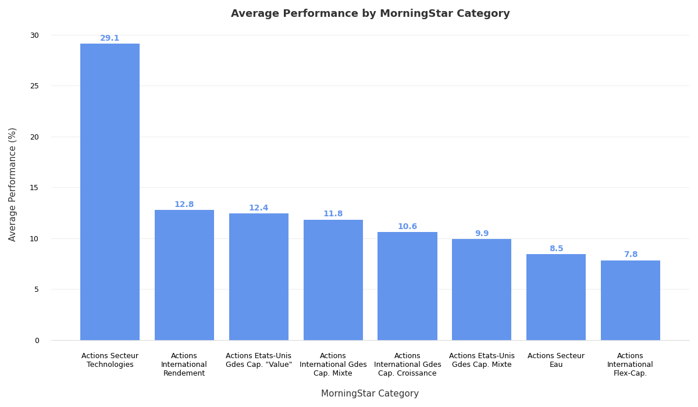
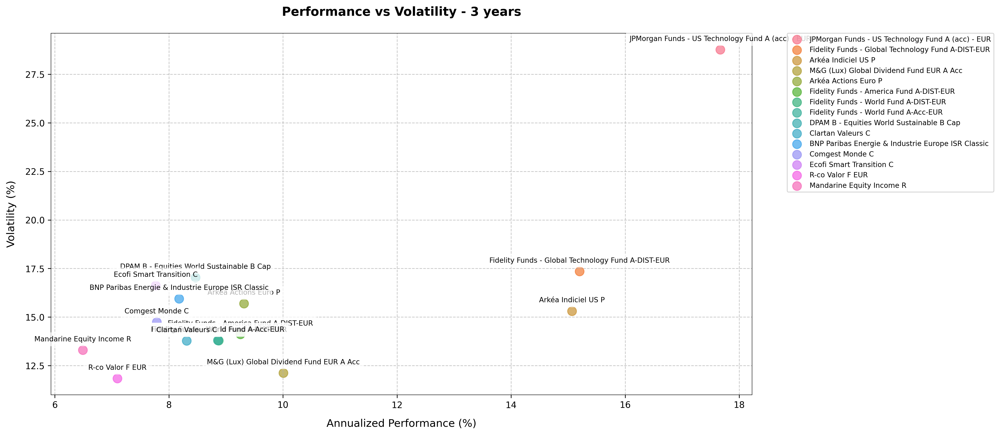
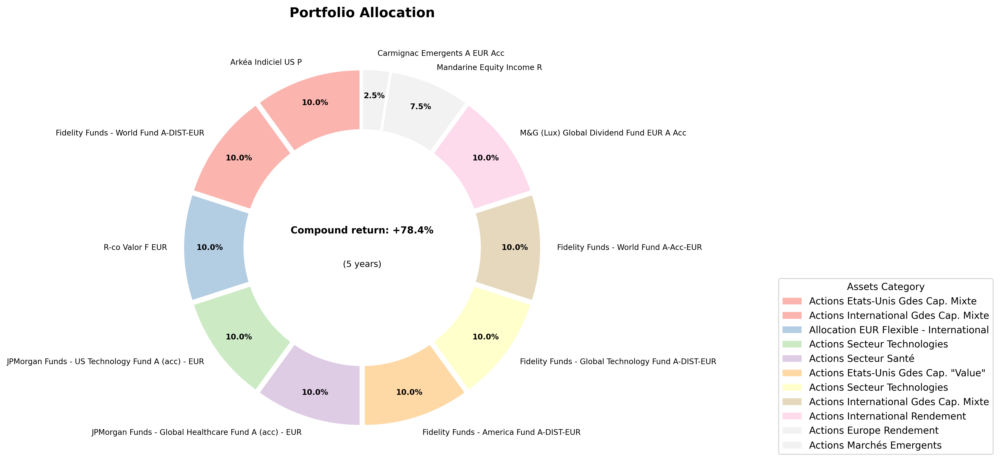
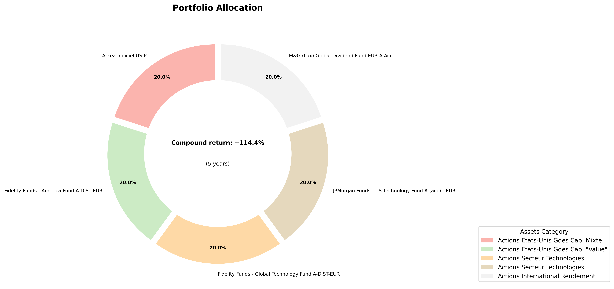

# Portfolio Optimizer for PREVI-OPTIONS

This project is a portfolio optimizer for PREVI-OPTIONS French assurance-vie funds.

## Preprocessing

The data comes as an Excel file named PREVI-OPTIONS.xls. The file can be found on the [PREVI-OPTIONS website](https://www.previ-direct.com/web/eclient-suravenir/perf-uc-previ-options).

The preprocessing is done in the `preprocessing.py` file.

The processed data is saved in the `data/processed/data.csv` file.

## Analysis

The analysis is done in the `performance-analysis.ipynb` file. The visualizations are stored in the `visualizations` folder.

Notably, the average performance according to the Morningstar category is plotted below.



The returns over volatility is plotted below.



## Portfolio Optimizer

A basic portfolio optimizer is implemented in the `portfolio-optimizer.py` file. The simplicity of the data induced me to implement a basic optimization strategy.

The optimizer maximizes the Sharpe ratio, which is defined as the ratio of the portfolio return minus the risk-free rate over the portfolio volatility, which is defined as the square root of the portfolio variance, using the covariance matrix of the yearly returns.

### Running the optimizer

To run the optimizer, you can use the following command:

```bash
python -m venv venv
source venv/bin/activate # On Windows: venv\Scripts\activate
pip install -r requirements.txt
python portfolio-optimizer.py
```

## Conclusion

The optimizer is able to find a portfolio that maximizes the Sharpe ratio. Here are some of the results:


Portfolio allocation for a 10% maximum single position size.


Portfolio allocation for a 20% maximum single position size.


Portfolio allocation for a 30% maximum single position size.

### Limitations

The optimizer is based on yearly returns, and so is the resulting Sharpe ratio. The Sharpe ratio should be calculated on daily values for an accurate risk-adjusted performance evaluation.

As some products have not been available for the whole period, the optimizer has been run on a subset of the data. The optimizer should be run on the whole period to get a more accurate result.