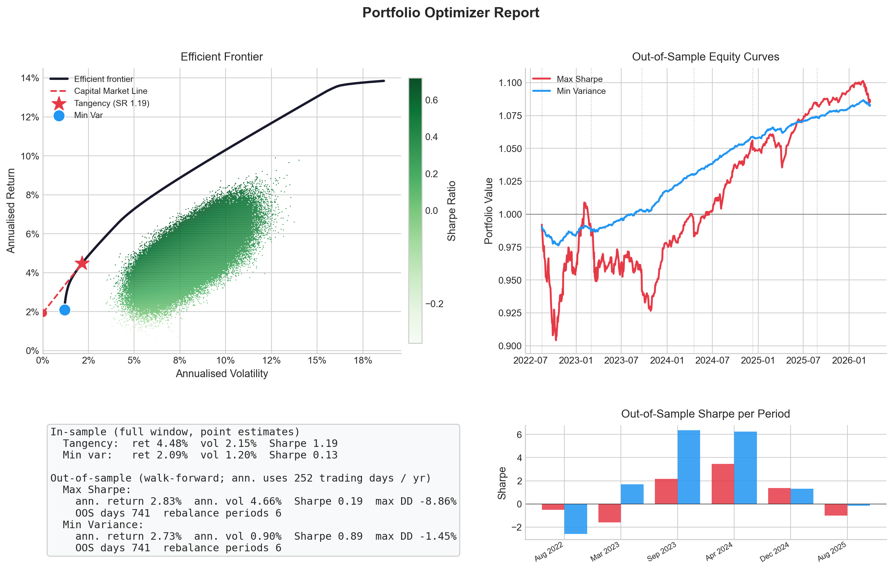

# Portfolio Optimizer — PREVI-OPTIONS

Personal project: **Markowitz-style optimisation** on OPCVM funds from [Previ-Options](https://www.previ-direct.com/), using local **Parquet** prices and a small Python pipeline (scrape → load → optimise → walk-forward backtest → one figure).

## Pipeline

1. **`build_database`** — Scrape the fund list, validate tickers with `yfinance`, append **hive-partitioned** Parquet under `src/data/opcvm_parquet/` (plus `ticker_meta.parquet`, `last_dates.parquet`).
2. **`data.load_prices_parquet`** — Read prices with **PyArrow** (`partitioning="hive"`); pivot to wide; filter by history length and per-asset coverage.
3. **`markowitz`** — Log returns, **Ledoit–Wolf** covariance, **max Sharpe** / **min variance**, **efficient frontier** (target-vol sweep), **walk-forward** backtests, **1/N** benchmark, marginal **risk contributions**.
4. **`plots.plot_report`** — Single PNG: frontier (+ CML), OOS equity curves, clustered **correlation** heatmap, risk-contribution bars (fund names from metadata when available).
5. **`main.py`** — `uv run main.py` runs ingest then `run_analysis.main()`.

## Quick start

```bash
uv sync
uv run main.py              # incremental Parquet update + analysis
uv run main.py --rebuild    # full re-scrape + rebuild, then analysis
```

Outputs: `src/figures/portfolio_report.png` and a short log to the terminal. Needs network for the first build / rebuild.

## Configuration

All defaults are in [`src/config.py`](src/config.py) (paths, `YEARS`, `MIN_DATA_FILL_RATIO`, risk-free rate, rebalance horizon, `TRANSACTION_COST`, `TURNOVER_PENALTY`, etc.). No environment variables.

| Parameter | Default | Role |
|-----------|---------|------|
| `YEARS` | 6 | Calendar window for prices |
| `MIN_DATA_FILL_RATIO` | 0.8 | Drop assets with too many missing days |
| `RISK_FREE_ANNUAL` | 1.93% | €STR-style rate for Sharpe / CML |
| `REBAL_DAYS` / `MIN_TRAIN_DAYS` | 126 / 504 | Walk-forward cadence and burn-in |
| `TRANSACTION_COST` | 1% | Applied to turnover on **optimised** backtests only (`walk_forward_backtest`). The **1/N** helper does not model costs—set cost to `0` for a fair gross comparison if needed. |

## Report preview



## Layout

```
.
├── main.py
├── pyproject.toml
├── README.md
├── src/
│   ├── config.py
│   ├── data.py              # Parquet → wide prices
│   ├── markowitz.py         # Optimisation & backtests
│   ├── plots.py             # `portfolio_report.png`
│   ├── run_analysis.py      # End-to-end analysis
│   ├── build_database.py    # Scrape & ingest
│   ├── data/                # Generated data (often gitignored)
│   └── figures/             # Generated plots
└── tests/
```

## Development

```bash
uv run ruff check .
uv run ruff format .
uv run pytest
```

## License

Apache License 2.0 — see [LICENSE](LICENSE).
