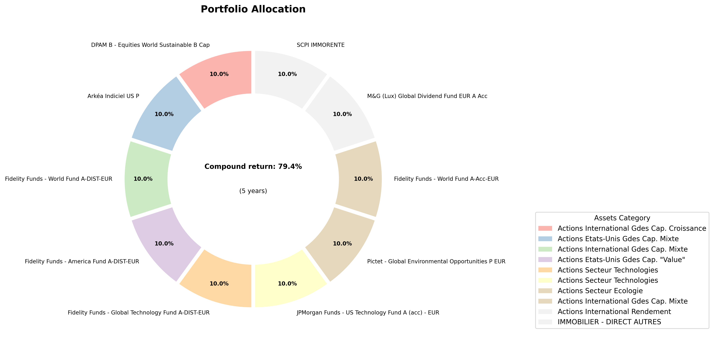
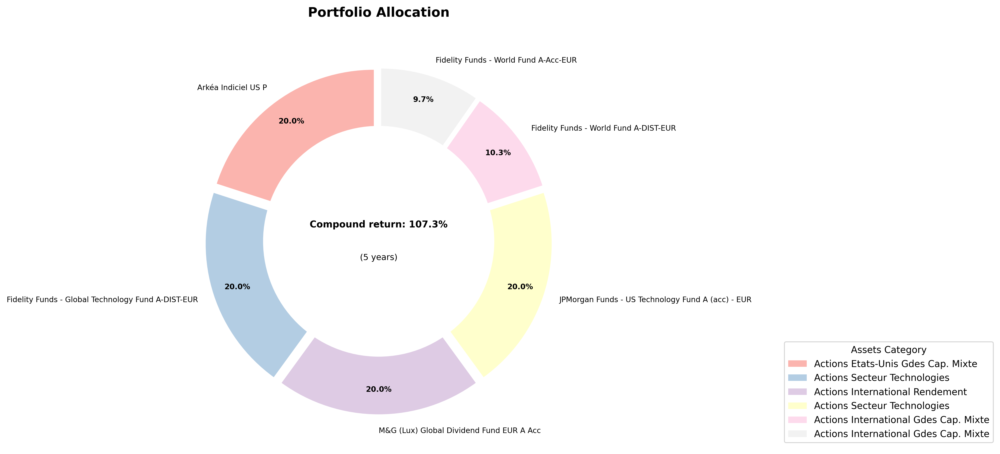
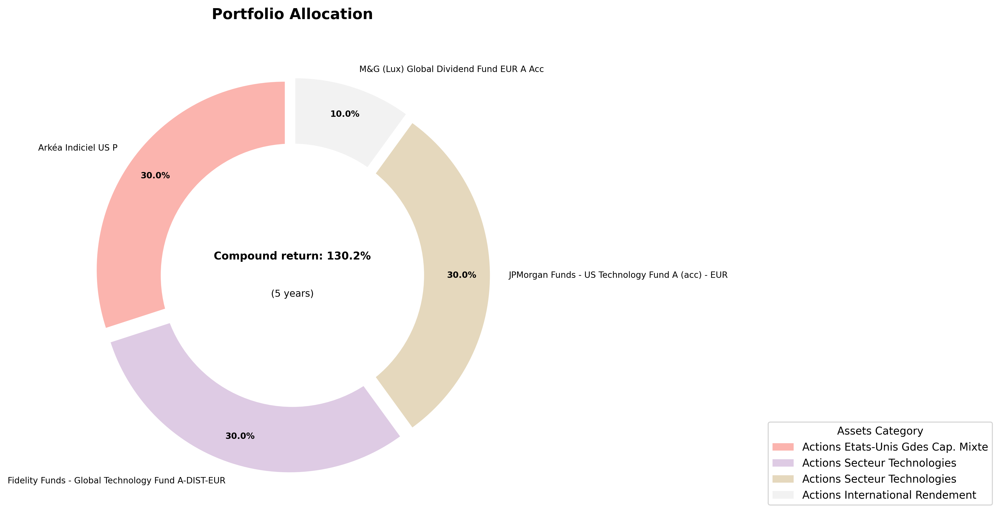

# Portfolio Optimizer for PREVI-OPTIONS

This project is a portfolio optimizer for PREVI-OPTIONS French assurance-vie funds.

## Preprocessing

The data comes as an Excel file named PREVI-OPTIONS.xls. The file can be found on the [PREVI-OPTIONS website](https://www.previ-direct.com/web/eclient-suravenir/perf-uc-previ-options).

The preprocessing is done in the `preprocessing.py` file.

The processed data is saved in the `data/processed/data.csv` file.

## Analysis

The analysis is done in the `performance-analysis.ipynb` file. The visualizations are stored in the `visualizations` folder.

Notably, the average performance according to the Morningstar category is plotted below.

{width=1000}

The returns over volatility is plotted below.

{width=1000}

## Portfolio Optimizer

A basic portfolio optimizer is implemented in the `portfolio-optimizer.py` file. The simplicity of the data induced me to implement a basic optimization strategy.

The optimizer maximizes the Sharpe ratio, which is defined as the ratio of the portfolio return minus the risk-free rate over the portfolio volatility.

### Running the optimizer

To run the optimizer, you can use the following command:

```bash
python -m venv venv
source venv/bin/activate # On Windows: venv\Scripts\activate
pip install -r requirements.txt
python portfolio-optimizer.py
```

## Conclusion

The optimizer is able to find a portfolio that maximizes the Sharpe ratio. Here are some of the results:

{width=1000}
Portfolio allocation for a 10% maximum single position size.

{width=1000}
Portfolio allocation for a 20% maximum single position size.

{width=1000}
Portfolio allocation for a 30% maximum single position size.